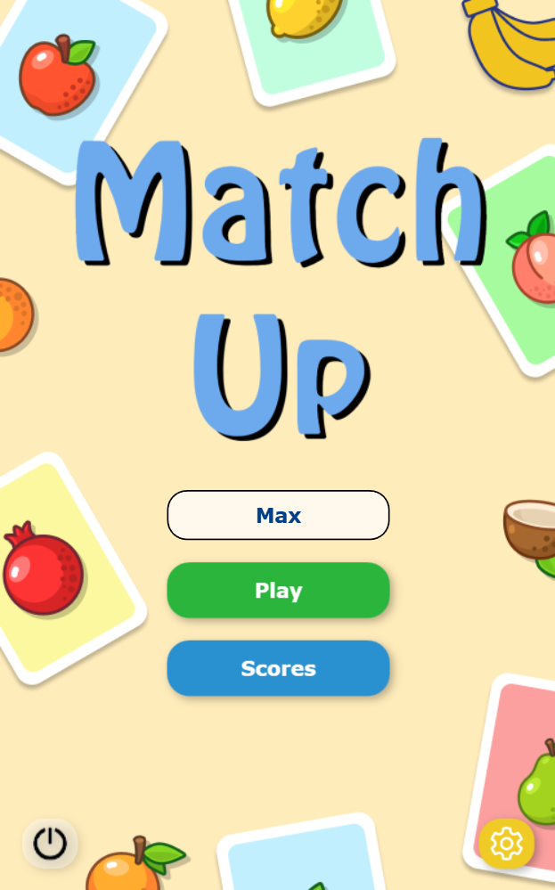
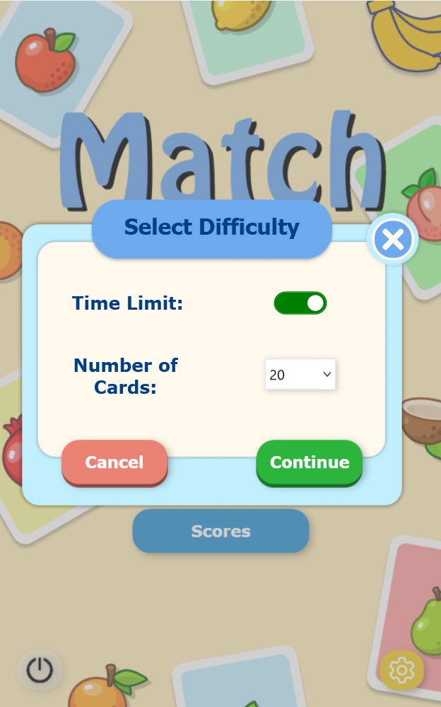
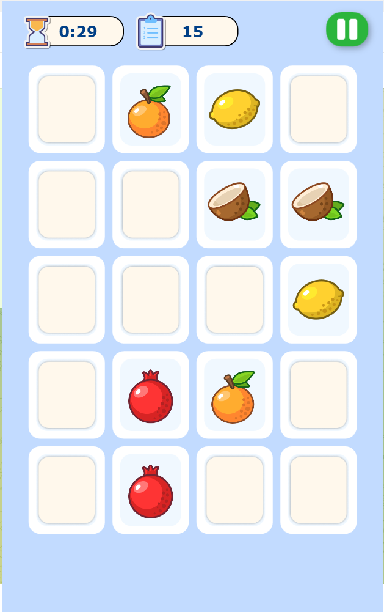
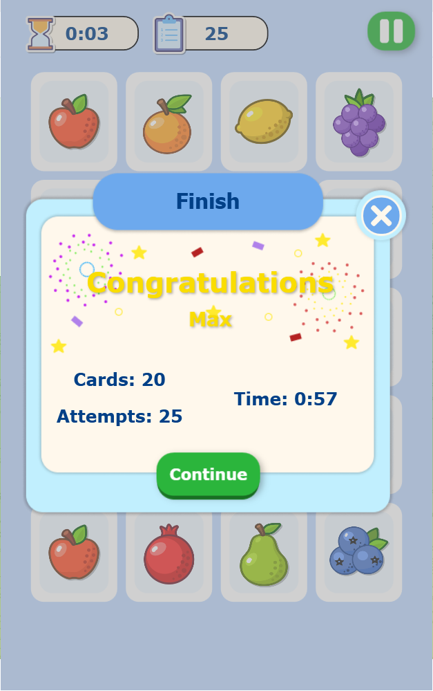
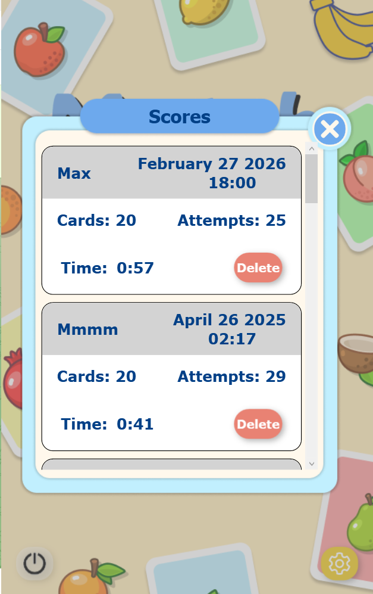

# 🎮 MatchUp

MatchUp is a memory-game, where player need to find pairs of identical cards in a limited time. 

The game is developed in .NET WPF using the MVVM pattern.

## Gameplay

- At the beginning, all cards are turned over
- The player opens 2 cards
- If cards are the same - they remain open
- If not - they are turned over
- The goal is to find all pairs in the minimum number of attempts and time

## Technologies & Concepts

- .NET (WPF)
- MVVM architecture
- ICommand, INotifyPropertyChanged
- JSON serialization (game history persistence)
- log4net (logging)
- MSTest (unit testing)

## Screenshots

### 🏠 Start Screen

### 🎮 Game Mode Selection

### 🧩 Gameplay

### 🏆 Victory Screen

### ❌ Defeat Screen

### 📊 Game History

